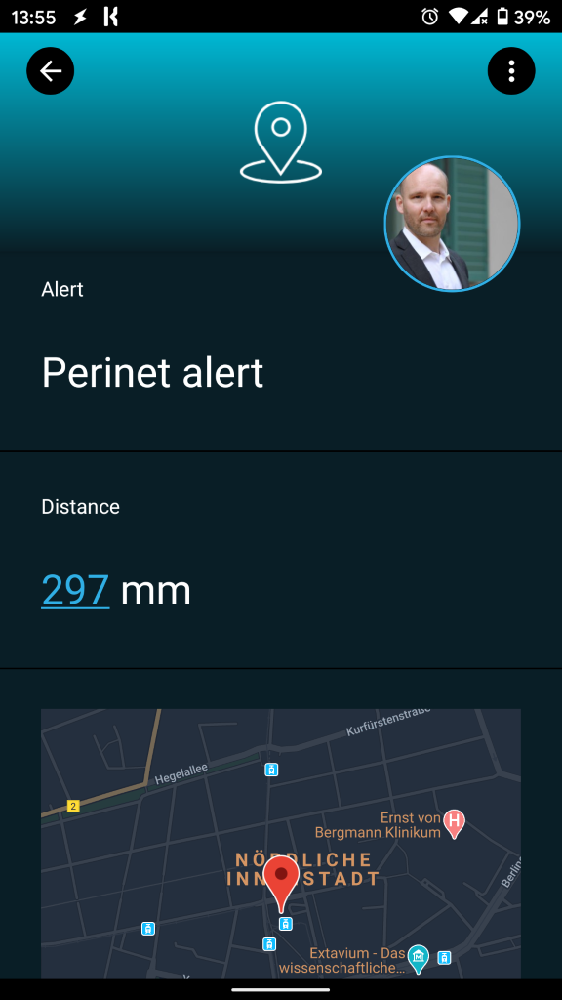
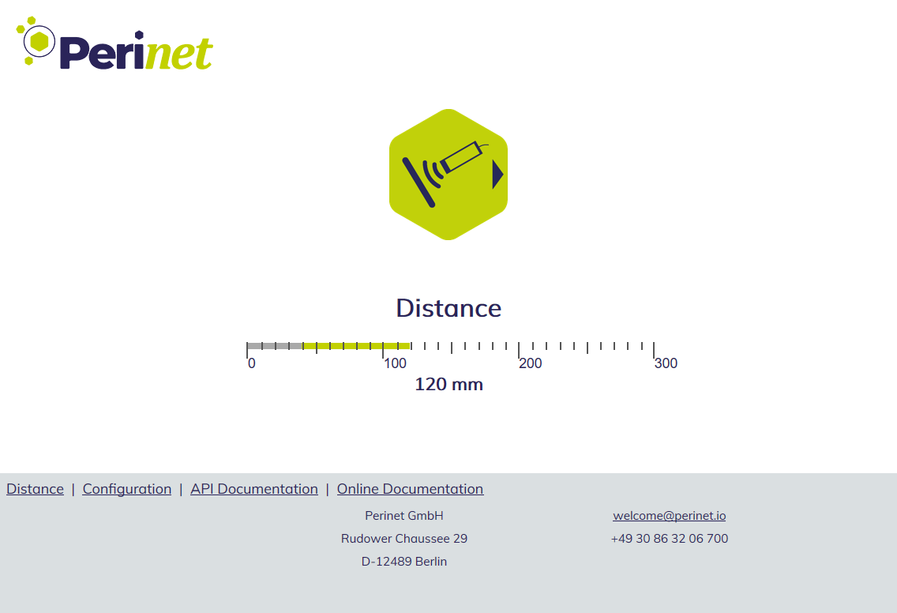
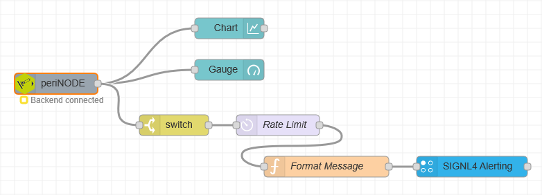

# Mobile alerting with tracking & escalation for Perinet

Mobile alerting with tracking, duty planning and escalation for Perinet.

## Why SIGNL4

Perinet focuses on the seamless connection of sensors and actuators with IT-systems. It easily and securely bridges the gap between production and IT and enables intelligent sensor-to-cloud solutions for IoT, IIoT & Industry 4.0 use cases. Pairing these powerful devices with SIGNL4 can enhance your daily operations with an extension to your team on the shop floor or in the field.

## How it Works

All it takes to pair Perinet and SIGNL4 is Node-RED running on HARTING MICA or on another edge device or industrial PC. Also, any other MQTT gateway will do. From there the respective data is transferred to SIGNL4 and thus alerts the responsible team.

## Integration Capabilities

- Service engineers alerted via mobile push, text and voice
- Integration with SIGNL4 via webhook or email (SMTP)
- Staff can acknowledge and take ownership for critical events that occur
- Alerts are escalated in case of no response
- Communicate within an alert to address a particular problem
- Tracking and visibility of problem solutions
- Integrated on-call duty planning
- Alert on critical IoT device states
- Two-way integration to interact or set the device state

## Scenarios

- Industrial IoT
- Industry 4.0
- IoT Service Alerting
- IoT Device Management
- IT, Manufacturing, Utility, Oil and Gas, Agriculture, etc.

## How To Integrate

Integrating SIGNL4 with Perinet

In our example we integrate SIGNL4 using Node-RED running on HARTING MICA.

We have connected a distance sensor to the periNODE smart adapter that is sending distance information to the HARTING MICA via MQTT.

There, Node-RED is running. The respective flow processes the information coming from the  periNODE. We use the SIGNL4 node in Node-RED to send the alert data to your SIGNL4 team. All you need to configure in your SIGNL4 node is your SIGNL4 team secret.

SIGNL4 is a mobile alert notification app for powerful alerting, alert management and mobile assignment of work items. Get the app at https://www.signl4.com.

You can find a sample Node-RED flow in GitHub:
https://github.com/signl4/signl4-integration-perinet
